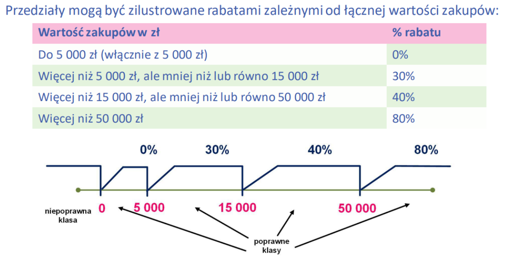

# Zadania na zajecia #20 (Unit Tests)
1. Napisz metodę calculateDiscount według wymagań na slajdzie

2. Napisz testy dla metody CalculateDiscount:
   * Pamiętaj o pokryciu klas równoważności
   * Użyj AssertEquals
   * Podpowiedź przy doublach ta metoda będzie potrzebowała dodatkowego parametru